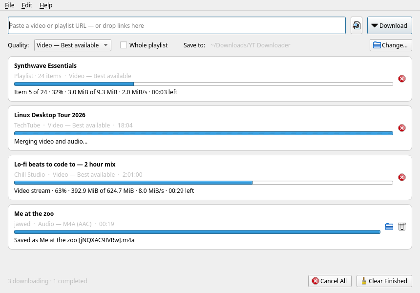
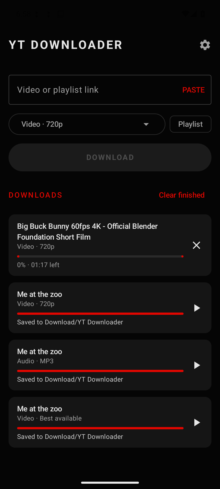

<div align="center">


# YT Downloader

**A clean, native app for downloading video and audio from YouTube and 1,000+ other sites, on Linux, Windows and Android.**

[](https://github.com/MRVIMA/yt-downloader/releases/latest)
[](https://github.com/MRVIMA/yt-downloader/actions/workflows/ci.yml)
[](LICENSE)


&nbsp;&nbsp;

</div>

---

## About

**YT Downloader** saves videos and music from YouTube and [over 1,000 other websites](https://github.com/yt-dlp/yt-dlp/blob/master/supportedsites.md) to your computer or phone. Paste a link, or share it from the YouTube app, choose a quality and press **Download**. You get a ready-to-play file with its title, artist and cover art already filled in.

It's free, open source, has no ads, and works the same way on **Linux, Windows and Android**.

### What you can do

| | |
|---|---|
| 🎬 **Video** | Best quality available, or choose 4K, 1440p, 1080p, 720p, 480p or 360p |
| 🎵 **Audio only** | MP3, M4A (AAC) or Opus, for music and podcasts |
| 📃 **Playlists** | Download a whole playlist into its own folder, with numbered files |
| ⏬ **Download queue** | Add as many links as you like. Each shows its progress, speed and time left, with cancel and retry |
| 🏷️ **Ready-to-play files** | Title, artist, cover art, chapters and subtitles are saved inside the file |
| 🔐 **Signed-in videos** | Uses your browser's login for age-restricted or members-only videos |
| 📱 **Share to download** (Android) | In the YouTube app tap **Share → YT Downloader**. Downloads continue in the background |
| ⌨️ **Command line** (Linux/Windows) | `yt-downloader-cli` for scripts and power users |

### Which version should I download?

| Your device | Get this | Why |
|---|---|---|
| **Any Linux distro** | `…-x86_64.AppImage` | One file, nothing to install. Works on Ubuntu, Debian, Fedora, Mint, Arch and more |
| **Arch / Manjaro / CachyOS** | `yay -S yt-downloader` (AUR) | Updates with the rest of your system |
| **Windows 10/11** | `…-Setup.exe` | Normal installer with Start-menu and desktop icons. A portable `.zip` is also available |
| **Android phone** | `…-android-arm64-v8a.apk` | Fits almost every phone. Not sure? Use the `universal` APK |

Everything you need comes with the **AppImage, Windows and Android** versions, including the download engine (yt-dlp) and the video tool (ffmpeg). Step-by-step instructions are under [Installation](#installation).

### How it works

YT Downloader is a friendly app built on **[yt-dlp](https://github.com/yt-dlp/yt-dlp)**, the widely used, actively maintained downloader that keeps up with changes to YouTube and other sites. YouTube sends video and sound as separate streams, so the app downloads both and uses **ffmpeg** to join them into one file.

Sites change often. If downloads suddenly stop working, updating yt-dlp almost always fixes it:
- **Android:** ⚙ Settings → **Update yt-dlp**
- **Linux:** update the AppImage, or run `yay -Syu` / the install script again
- **Windows:** install the latest release

### Privacy

- No account, no ads, no tracking, no analytics.
- The app only connects to the site you're downloading from, and to GitHub when you update yt-dlp.
- Your downloads and settings stay on your device.

### Project status

**Version 1.0.0**, the first stable release. Planned next:
- a code-signed Windows installer (removes the SmartScreen warning)
- an F-Droid listing for Android

Ideas and bug reports are welcome on the [issue tracker](https://github.com/MRVIMA/yt-downloader/issues).

---

## Download

| Platform | Get it | Notes |
|---|---|---|
| 🐧 **Linux** | [`YT-Downloader-x.y.z-x86_64.AppImage`](#appimage-easiest) · [install script](#option-a-install-script-recommended-any-distro) · [AUR](#option-b-arch-linux-aur) | The AppImage runs on any distro with nothing to install; ffmpeg and Deno are included |
| 🪟 **Windows 10/11** | [`YT-Downloader-x.y.z-Setup.exe`](https://github.com/MRVIMA/yt-downloader/releases/latest) | Installer, or a portable `.zip`. ffmpeg and Deno are included |
| 🤖 **Android 8+** | [`YT-Downloader-x.y.z-android-arm64-v8a.apk`](https://github.com/MRVIMA/yt-downloader/releases/latest) | Native app with Share → Download. yt-dlp and ffmpeg are included |

All builds are attached to each [GitHub release](https://github.com/MRVIMA/yt-downloader/releases). Android APKs are signed by **THE VOID PROTOCOL**; see [Verify your download](#verify-your-download).

---

## More features

- **Drag and drop** links onto the window, or press <kbd>Ctrl</kbd>+<kbd>Shift</kbd>+<kbd>V</kbd> to paste and download in one step.
- **Several downloads at once.** You choose how many in Preferences.
- **Native look** on KDE Plasma, GNOME and other desktops (Qt 6), with light and dark themes that follow your system.
- **Android:** files are saved to `Download/YT Downloader`, and videos use H.264, so they play on any phone.

## Requirements (Linux source install)

The AppImage, Windows and Android builds include everything below. This table only matters if you install from source.

| Dependency | Why | Required? |
|---|---|---|
| Python ≥ 3.10 | runs the app | **yes** |
| [ffmpeg](https://ffmpeg.org) | joins YouTube's separate video and audio streams, converts audio, embeds cover art | **required for YouTube video** |
| [Deno](https://deno.com) | lets yt-dlp solve YouTube's JavaScript challenges | **strongly recommended** for YouTube |
| PySide6 (Qt 6) | the user interface | installed automatically |

> **Why Deno?** Since late 2025, YouTube requires a JavaScript runtime for many formats. Without one, some videos fail or only low-quality formats are offered. The app shows a warning banner if Deno is missing.

---

## Installation

- [Linux](#linux)
- [Windows](#windows)
- [Android](#android)

## Linux

### AppImage (easiest)

A single file that runs on almost any 64-bit distro: Ubuntu 22.04+, Debian 12+, Fedora 36+, Linux Mint 21+, openSUSE, Arch, Manjaro and others. ffmpeg and Deno are **included**, so there's nothing else to install.

1. Download **`YT-Downloader-x.y.z-x86_64.AppImage`** from the [latest release](https://github.com/MRVIMA/yt-downloader/releases/latest).
2. Make it executable and run it:
   ```bash
   chmod +x YT-Downloader-*-x86_64.AppImage
   ./YT-Downloader-*-x86_64.AppImage
   ```
   You can also right-click the file → **Properties → Permissions → Allow executing as program**, then double-click it.

**Add it to your app menu:** install [Gear Lever](https://flathub.org/apps/it.mijorus.gearlever) (any distro, via Flatpak) or [AppImageLauncher](https://github.com/TheAssassin/AppImageLauncher), then open the AppImage with it. Gear Lever can also **update** the AppImage in place, because it has update information built in.

**Command line:** the CLI is built in:
```bash
./YT-Downloader-*-x86_64.AppImage cli -a "https://www.youtube.com/watch?v=..."
```

<details>
<summary><b>"dlopen(): error loading libfuse.so.2" / AppImage won't start</b></summary>

Some distros don't ship FUSE 2, which older AppImage tools rely on. Either install it (Ubuntu 22.04+: `sudo apt install libfuse2`; Fedora: `sudo dnf install fuse-libs`), or run the AppImage without FUSE:

```bash
./YT-Downloader-*-x86_64.AppImage --appimage-extract-and-run
```
</details>

### Or install from source

Use this if you'd rather keep the app up to date with your package manager, or if you're on an ARM machine.

### 1. Install system dependencies

<details open>
<summary><b>Arch Linux / Manjaro / CachyOS / EndeavourOS</b></summary>

```bash
sudo pacman -S --needed python ffmpeg deno pyside6 git
```
</details>

<details>
<summary><b>Debian / Ubuntu / Linux Mint / Pop!_OS</b></summary>

```bash
sudo apt update
sudo apt install python3 python3-venv python3-pip ffmpeg git curl unzip \
                 libxcb-cursor0 libegl1
curl -fsSL https://deno.land/install.sh | sh    # installs Deno to ~/.deno
```
Then open a new terminal so `deno` is on your `PATH`.
</details>

<details>
<summary><b>Fedora</b></summary>

```bash
sudo dnf install python3 ffmpeg-free git curl unzip xcb-util-cursor
curl -fsSL https://deno.land/install.sh | sh
```
For the full (non-free) ffmpeg codecs, enable [RPM Fusion](https://rpmfusion.org/Configuration) and run `sudo dnf swap ffmpeg-free ffmpeg --allowerasing`.
</details>

<details>
<summary><b>openSUSE</b></summary>

```bash
sudo zypper install python3 ffmpeg git curl unzip
curl -fsSL https://deno.land/install.sh | sh
```
</details>

### 2. Install YT Downloader

#### Option A: Install script (recommended, any distro)

```bash
git clone https://github.com/MRVIMA/yt-downloader.git
cd yt-downloader
./scripts/install.sh
```

The script:
- creates a private virtual environment in `~/.local/share/yt-downloader/`
- adds the `yt-downloader` and `yt-downloader-cli` commands to `~/.local/bin/`
- adds **YT Downloader** to your application menu, with its icon

Add `--desktop-shortcut` to also put a launcher icon on your desktop:

```bash
./scripts/install.sh --desktop-shortcut
```

It doesn't need `sudo`. If your distro already provides PySide6, the script reuses it instead of downloading Qt again.

**System-wide install** (all users):

```bash
sudo PREFIX=/usr/local ./scripts/install.sh
```

**Update.** Pull the latest code and run the script again. This also updates yt-dlp, which matters because YouTube changes often:

```bash
git pull && ./scripts/install.sh
```

**Uninstall:**

```bash
./scripts/uninstall.sh
```

#### Option B: Arch Linux (AUR)

```bash
yay -S yt-downloader        # or: paru -S yt-downloader
```

To build without an AUR helper:

```bash
git clone https://aur.archlinux.org/yt-downloader.git
cd yt-downloader
makepkg -si
```

This installs a proper pacman package that uses your system's `pyside6`, `yt-dlp` and `ffmpeg`, so `sudo pacman -Syu` keeps them updated. Remove it with `sudo pacman -R yt-downloader`. Maintainers: see [`packaging/arch/README.md`](packaging/arch/README.md).

#### Option C: pipx

```bash
pipx install git+https://github.com/MRVIMA/yt-downloader.git
```

This installs the `yt-downloader` and `yt-downloader-cli` commands, but no app-menu entry. Update with `pipx upgrade yt-downloader`.

#### Option D: Run from source (development)

```bash
git clone https://github.com/MRVIMA/yt-downloader.git
cd yt-downloader
make venv     # python3 -m venv .venv && pip install -e ".[dev]"
make run
```

### 3. Check the installation

```bash
yt-downloader --version
yt-downloader-cli --version
ffmpeg -version | head -1
deno --version
```

---

## Windows

**Requirements:** Windows 10 or 11, 64-bit. Everything else is included: Python, Qt, yt-dlp, ffmpeg and Deno.

### Installer (recommended)

1. Download **`YT-Downloader-x.y.z-Setup.exe`** from the [latest release](https://github.com/MRVIMA/yt-downloader/releases/latest).
2. Run it. If Windows SmartScreen says *"Windows protected your PC"*, click **More info → Run anyway**. This happens because the installer isn't code-signed yet.
3. Choose whether to create a desktop icon, then click **Install**.
4. Start **YT Downloader** from the Start menu or the desktop.

By default the installer installs only for you (no admin rights needed). You can choose "Install for all users" in the first dialog.
**Uninstall:** *Settings → Apps → Installed apps → YT Downloader → Uninstall.*

### Portable version

Download **`YT-Downloader-x.y.z-Windows-Portable.zip`**, extract it anywhere (a USB stick works too) and run **`YT Downloader.exe`**. Nothing is written to the registry except your settings.

### Command line on Windows

`yt-downloader-cli.exe` sits next to the app (by default in `%LOCALAPPDATA%\Programs\YT Downloader\`):

```powershell
& "$env:LOCALAPPDATA\Programs\YT Downloader\yt-downloader-cli.exe" -a "https://www.youtube.com/watch?v=..."
```

### Build the Windows version yourself

Run this on Windows with [Python 3.10+](https://www.python.org/downloads/) and [Inno Setup 6](https://jrsoftware.org/isdl.php) installed:

```powershell
git clone https://github.com/MRVIMA/yt-downloader.git
cd yt-downloader
.\packaging\windows\build.ps1
```

The installer and portable zip appear in `dist\`. GitHub Actions builds both automatically for every release tag.

---

## Android

**Requirements:** Android 8.0 or newer.

> Google Play doesn't allow YouTube downloaders, so the app is distributed as an APK on GitHub Releases.

### Install

1. On your phone, open the [latest release](https://github.com/MRVIMA/yt-downloader/releases/latest) and download the APK for your phone:

   | File | For |
   |---|---|
   | `…-android-arm64-v8a.apk` | **almost all phones from 2017 onwards** (pick this if unsure) |
   | `…-android-armeabi-v7a.apk` | older 32-bit phones |
   | `…-android-x86_64.apk` | Chromebooks, emulators |
   | `…-android-universal.apk` | any device (larger download) |

2. Open the downloaded file. If Android asks, allow your browser to **install unknown apps**, then tap **Install**.
3. Open **YT Downloader** and allow notifications, so you can see download progress.

The first launch takes a few seconds while the app unpacks yt-dlp.

**Updating:** install the newer APK over the old one; your downloads and settings are kept. Updates only install over an APK signed with the same key. If you installed a test build from elsewhere, uninstall it first.

### Use

- **Share** a video from the YouTube app or any browser and choose **YT Downloader**. The link is filled in for you; pick a quality and tap **DOWNLOAD**.
- Or paste a link (tap **PASTE**).
- Downloads continue in the background, with progress in the notification shade. Tap a finished download to play it.
- Files are saved to **`Download/YT Downloader/`**. Playlists go into their own subfolder.
- If downloads start failing, go to **⚙ Settings → Update yt-dlp**. Sites change often, and yt-dlp updates fix most failures.

### Build the Android app yourself

You need JDK 17+ and the Android SDK; [Android Studio](https://developer.android.com/studio) includes both.

```bash
cd android
./gradlew testDebugUnitTest    # unit tests
./gradlew assembleDebug        # debug APKs → app/build/outputs/apk/debug/
./gradlew assembleRelease      # release APKs → app/build/outputs/apk/release/
```

Without a signing key, release builds fall back to the debug key. Setting up a release key is described in [`android/README.md`](android/README.md).

---

## Verify your download

Each release lists SHA-256 checksums. To check a file on Linux:

```bash
sha256sum YT-Downloader-*.AppImage YT-Downloader-*.apk
```

**Android APKs** are signed with THE VOID PROTOCOL's release key. Its certificate SHA-256 fingerprint is:

```
38:9B:ED:DB:D1:2D:22:D6:7F:95:AA:ED:E0:D8:46:97:68:0C:98:61:9A:D1:5C:62:05:8D:40:FD:0E:89:C9:BE
```

Check it with `apksigner verify --print-certs YT-Downloader-*.apk` (Android SDK), or compare it in an app such as [AppVerifier](https://github.com/soupslurpr/AppVerifier). An APK with a different fingerprint was **not** built by us.

---

## Usage (Linux & Windows desktop app)

### Desktop app

1. Open **YT Downloader** from your application menu (or run `yt-downloader`).
2. Paste a link into the box. You can also drag a link from your browser onto the window.
3. Choose a **Quality**, and tick **Whole playlist** if you want every video in a playlist.
4. Press **Download** or <kbd>Enter</kbd>.

Files are saved to `~/Downloads/YT Downloader/` by default. Change this with **Change…** or in **Edit → Preferences**.

| Shortcut | Action |
|---|---|
| <kbd>Enter</kbd> | Download the link in the box |
| <kbd>Ctrl</kbd>+<kbd>Shift</kbd>+<kbd>V</kbd> | Paste from clipboard and download immediately |
| <kbd>Ctrl</kbd>+<kbd>O</kbd> | Open the download folder |
| <kbd>Ctrl</kbd>+<kbd>,</kbd> | Preferences |
| <kbd>Ctrl</kbd>+<kbd>Q</kbd> | Quit |

You can also start downloads from a terminal and they appear in the queue:

```bash
yt-downloader "https://www.youtube.com/watch?v=jNQXAC9IVRw"
```

### Command line

```bash
yt-downloader-cli URL                         # best quality video
yt-downloader-cli -f 1080 URL                 # up to 1080p
yt-downloader-cli -f 720 -c mp4 URL           # 720p in an MP4 container
yt-downloader-cli -a URL                      # audio only, MP3
yt-downloader-cli -f opus URL                 # audio only, Opus
yt-downloader-cli -p PLAYLIST_URL             # entire playlist
yt-downloader-cli --subs en,de URL            # embed English and German subtitles
yt-downloader-cli -o ~/Music -a URL1 URL2     # several URLs, custom folder
yt-downloader-cli --cookies-from-browser firefox URL
```

Run `yt-downloader-cli --help` for every option. Formats: `best`, `2160`, `1440`, `1080`, `720`, `480`, `360`, `mp3`, `m4a`, `opus`.

---

## Configuration

| What | Where |
|---|---|
| Settings | `~/.config/yt-downloader/yt-downloader.conf` (edit via **Preferences**) |
| Logs | `~/.local/state/yt-downloader/yt-downloader.log` (**Help → Open Log Folder**) |
| Default downloads | `~/Downloads/YT Downloader/` |

**Preferences** include: download folder, default quality, container (Auto / MP4 / MKV), file-name template, how many downloads run at once, metadata/thumbnail/subtitle embedding, and browser cookies.

The file-name template uses [yt-dlp's output template syntax](https://github.com/yt-dlp/yt-dlp#output-template). For example, `%(uploader)s/%(title)s.%(ext)s` sorts downloads into a folder per channel.

---

## Troubleshooting

<details>
<summary><b>"Sign in to confirm you're not a bot" / age-restricted videos</b></summary>

Open **Preferences → Cookies from** and choose the browser where you're signed in to YouTube. On the CLI, use `--cookies-from-browser firefox`. Close Chromium-based browsers first if reading their cookies fails.
</details>

<details>
<summary><b>Downloads suddenly fail, or only low quality is available</b></summary>

YouTube changes often, and yt-dlp keeps up with it, so update yt-dlp first:

- Install script: `git pull && ./scripts/install.sh`
- AUR: `yay -Syu` (yt-dlp itself updates with `sudo pacman -Syu`)
- pipx: `pipx runpip yt-downloader install -U yt-dlp`

Also make sure Deno is installed (`deno --version`).
</details>

<details>
<summary><b>"ffmpeg is not installed" banner</b></summary>

Install ffmpeg with your package manager (see [step 1](#1-install-system-dependencies)) and restart the app. YouTube serves video and audio as separate streams, and ffmpeg is what joins them, so without it **YouTube video downloads don't work at all**. Audio-only downloads still work, but they're saved in the site's original format (usually `.webm`/Opus) instead of being converted. The Windows and Android apps include ffmpeg.
</details>

<details>
<summary><b>App or its icon doesn't appear in the menu</b></summary>

Log out and back in, or refresh the menu caches:

```bash
update-desktop-database ~/.local/share/applications
kbuildsycoca6 --noincremental      # KDE Plasma
```

The installer adds the icon as SVG plus PNGs from 16 to 512 px in `~/.local/share/icons/hicolor/`. If you installed an older version, run `./scripts/install.sh` again to add the PNGs.
</details>

<details>
<summary><b>"Could not load the Qt platform plugin xcb"</b></summary>

Install the missing library: `sudo apt install libxcb-cursor0` (Debian/Ubuntu) or `sudo dnf install xcb-util-cursor` (Fedora).
</details>

<details>
<summary><b>Android: "App not installed"</b></summary>

You probably picked the wrong APK for your phone's processor. Try `arm64-v8a`, or the `universal` APK. If an older version is installed from a different source, uninstall it first.
</details>

<details>
<summary><b>Android: downloads fail</b></summary>

Open **⚙ Settings → Update yt-dlp** and try again. Make sure you have an internet connection; downloads wait for one.
</details>

<details>
<summary><b>Command not found after installing</b></summary>

Add `~/.local/bin` to your `PATH`. For bash/zsh, add `export PATH="$HOME/.local/bin:$PATH"` to `~/.bashrc`/`~/.zshrc`. For fish, run `fish_add_path ~/.local/bin`.
</details>

---

## Project structure

```
yt-downloader/
├── src/yt_downloader/
│   ├── core/            # UI-independent engine (presets, yt-dlp options, download jobs)
│   ├── gui/             # Qt 6 interface (main window, queue items, preferences)
│   ├── resources/       # app icon
│   └── cli.py           # yt-downloader-cli
├── android/             # Android app (Kotlin, Jetpack Compose, youtubedl-android)
├── data/                # .desktop entry, AppStream metainfo, PNG icons (16–512 px)
├── docs/                # screenshots
├── packaging/arch/      # PKGBUILD, .SRCINFO, aur-publish.sh (AUR)
├── packaging/pyinstaller/  # shared PyInstaller recipe (Windows + AppImage)
├── packaging/appimage/  # AppImage build script and AppRun
├── packaging/windows/   # Inno Setup installer, build.ps1
├── scripts/             # install.sh / uninstall.sh
├── tests/               # pytest suite (runs headless)
└── .github/workflows/   # CI, release, Windows, AppImage and Android builds
```

## Development

```bash
make venv     # set up .venv
make run      # run the GUI with debug logging
make test     # run tests (headless)
make lint     # ruff
make build    # build wheel + sdist into dist/
```

| Build | Command | Notes |
|---|---|---|
| AppImage | `./packaging/appimage/build-appimage.sh` | Build on an old distro (CI uses Ubuntu 22.04). An AppImage only runs where glibc is at least as new as on the build machine. |
| Windows | `.\packaging\windows\build.ps1` | Run on Windows with Python and Inno Setup |
| Android | `cd android && ./gradlew assembleRelease` | see [`android/README.md`](android/README.md) |
| AUR | `./packaging/arch/aur-publish.sh` | see [`packaging/arch/README.md`](packaging/arch/README.md) |

Pushing a `vX.Y.Z` tag makes GitHub Actions build the AppImage, Windows installer and portable zip, and Android APKs, and attach them to the release.

See [CONTRIBUTING.md](CONTRIBUTING.md) for guidelines and the release process.

## Legal

YT Downloader is a front end for yt-dlp and is meant for downloading content you have the right to download: your own uploads, Creative Commons or public-domain media, or content the copyright holder lets you save. Downloading may break the terms of service of some websites. **You are responsible for how you use this software.** This project is not affiliated with YouTube or Google.

## License

[MIT](LICENSE) © 2026 THE VOID PROTOCOL

<div align="center"><sub>Made by <b>THE VOID PROTOCOL</b> · Powered by <a href="https://github.com/yt-dlp/yt-dlp">yt-dlp</a></sub></div>
